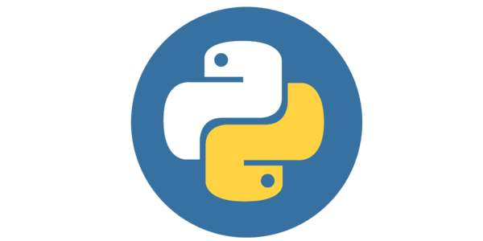

## 前言

> 人生苦短，我用 Python —— Life is short, you need Python

## 一 Python简介

Python的开发始于1989年，作者是 Guido von Rossum，1.0版正式发布于1994年，并于2000年发布了重要版本2.0，在该版本中实现了完整的垃圾回收，提供了对Unicode的支持，生态开始繁荣。  

2000年，Python3发布，该版本不完全兼容之前的Python代码，不过因为目前还有不少公司在项目和运维中使用Python 2.x版本，所以Python 3.x的很多新特性后来也被移植到Python 2.6/2.7版本中。 

Python的Logo：  
  

## 二 Python的特点

笔者认为Python最强大的优点有以下三处：
- 简洁：做一件事只有一种方法，学习曲线低，容易上手。
- 生态：代码开源，拥有强大的社区和生态圈，标准库极其强大。
- 扩展：是很好的胶水语言，可以调用C/C++代码，也可以在C/C++中调用Python。

Python的缺点主要集中在以下几点：
- 执行效率稍低：计算密集型任务需要借助C/C++
- 过简语法造成大项目的工程化重构难题

Python目前主要应用于：科学计算、运维、爬虫。Python在Web市场中占比极小，不能与Java、Php相比，现在甚至还不及Node.js的繁荣。    

## 三 Python安装

### 3.0 py2与py3

Python拥有2个互不兼容的版本：Python2和Python3，当前推荐使用Python3。当然，某些工具库还没有提供支持 Python 3.x。   

Python拥有下列两种常见的安装方式
- 官网下载安装：[网址](https://www.python.org/)，该方式适合python语法学习，web开发，爬虫开发，运维开发等场景
- 科学环境安装：[安装科学集成环境Anaconda](https://www.continuum.io/downloads)，该环境内置了python以及其他科学运算包，适合人工智能领域使用

### 3.1 Win安装Python

前往[官网](https://www.python.org/)下载对应操作系统的python安装包后，下一步下一步即可。  

注意：
- 安装目录建立使用无空格的英文目录
- win7系统需要预先安装Service Pack 1补丁包、Visual C++ Redistributable for Visual Studio 2015等动态库
- win7安装时，建议勾选`Add Python 3 to PATH`，并在`Optional Features`界面勾选`“pip”、“tcl/tk”、“Python test suite”`

### 3.2 Mac安装Python

Mac自带了Python2版本，打开命令行工具输入：
```
python          # 此时即可进入python2环境
```

Mac也可以额外安装Python3，让Python2和Python3共存。下载[官网](https://www.python.org/)的3.x版本pkg安装包即可，输入如下命令：
```
python3         # 此时可进入python3环境
exit()          # 退出环境
```

### 3.3 CentOS环境

Linux环境自带Python 2.x版本，输入如下命令查看：
```
python          # 此时即可进入python2环境
```

CentOS安装Python3需要使用源码编译方式安装，先安装依赖环境：
```
yum -y install wget gcc zlib-devel bzip2-devel openssl-devel ncurses-devel sqlite-devel readline-devel tk-devel gdbm-devel db4-devel libpcap-devel xz-devel libffi-devel
```

Python3安装：
```
# 下载Python3
wget https://www.python.org/ftp/python/3.7.4/Python-3.7.4.tgz
xz -d Python-3.7.4.tar.xz
tar -xvf Python-3.7.4.tar

# 安装Python3
cd Python-3.7.4
./configure --prefix=/usr/local/python3 --enable-optimizations
make && make install

# 配置环境变量
vim ~/.bash_profile
export PATH=$PATH:/usr/local/python3/bin
source ~/.bash_profile

# 测试python3环境
python3

# 退出环境
exit()          
```

## 四 科学环境安装 

科学环境主要自动集成了一些科学运算包，方便数据分析、机器学习。如果是语法学习、web开发、爬虫开发则无需该环境。  

当前Python的科学环境的集成安装包是 [Anaconda](https://www.continuum.io/downloads)，该环境包含了 conda命令、Python等 180 多个科学计算包及其依赖项，并且支持所有操作系统平台。  

Anaconda 安装后创建环境：
```
# 创建环境
conda create --name python3 python=3

# win切换环境
conda activate python3

# mac/linux切换环境
source activate python3

# 输入如下命令即可查看当前python环境是否已经切换到conda环境：
which python
```

安装Anaconda后，将会自带下列软件：
- Python：依据选择的Anaconda，决定python的版本
- Jupyter：一款编程/文档/展示软件，启动命令：`jupyter notebook`，可以实时查看运行过程，记录历史运行结果
- Sypder：适合熟悉Matlab的用户，使用简单的图形界面开发环境
- IPython：交互式命令行 Shell，唤起命令`ipython`

conda和pip类似，均为安装、卸载或管理Python第三方包：
- conda install 包名   pip install 包名
- conda uninstall 包名   pip uninstall 包名
- conda install -U 包名   pip install -U 包名

conda管理数据科学环境步骤:
```
# 打开Anaconda Prompt窗口，执行：
conda config --add channels https://mirrors.tuna.tsinghua.edu.cn/anaconda/pkgs/free/
conda config --set show_channel_urls yes

# 在用户目录下找到.condarc文件，删除第3行 -defaults 
```