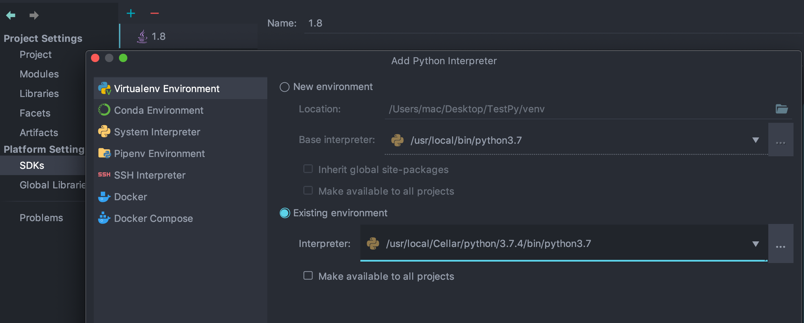

## 一 HelloWorld

新建文件`hello.py`，内容如下：
```py
print('hello, world!')         
```

运行`hello.py`：
```
python3 hello.py             # 注意：如果使用命令为 python，则启用python2解释器
hello, world!
```

推荐的Python开发工具室VSCode、Pycharm。这里要注意的是：Pycharm打开hello.py所在的文件夹后，是不识别pythonSDK（包含解释器）的，点击File-Project Structure-设置SDK，也可以新建自定义SDK目录，以mac为示例：  

  

SDK设置完毕后，需要设置当前项目启用该SDK：  



## 二 Python的解释器

Python的解析器（Interpreter），即解析执行Python源码的程序，HelloWorld程序能够运行依靠的就是安装Python时候默认的内置解释器：CPython。  

Python解析器有多种：
- CPython：官方提供默认解析器，由于使用C语言实现，所以称之为CPython。
- JPython：使用Java语言实现的Python解析器，将Python代码编程成Java字节码执行。
- IronPython：是运行在微软Net平台上的Python解析器，直接把Python代码编译成Net字节码。
- PyPy：使用Python语言实现的Python解析器。

输入如下命令，可以查看当前使用的python解释器
```
which python        
```

## 三 注释 

单行注释：
```py
# 这是第一个单行注释
print("hello python")
```

多行注释：
```py
'''
    这是一个多行注释
    这是一个多行注释
''' 
print("hello python")
```

## 四 中文支持

python3默认支持中文，但是在python2中需要在源码第一行额外添加：
```py
#coding=utf-8
print('你好')
```

注意，在python的语法规范中推荐使用的方式：
```py
# -*- coding:utf-8 -*-
```

## 五 输入输出

### 5.1 格式化输出

输出用于在命令行中显示数据：
```py
print("我今年12岁")
```

格式化输出：
```py
age = 10
print("我今年%d岁" % age)
```

换行输出：
```py
print("12345\n67890")
```

常见格式化符号：
```
%c	字符
%s	字符串
%d	有符号十进制整数
%u	无符号十进制整数
%o	八进制整数
%x	十六进制整数（小写字母0x）
%X	十六进制整数（大写字母0X）
%f	浮点数
%e	科学计数法（小写'e'）
%E	科学计数法（大写“E”）
%g	％f和％e 的简写
%G	％f和％E的简写
```

### 5.2 输入

输入用于获取键盘输入的数据，常见的输入函数是 `input()`，
```py
password = input("请输入密码:")
print('您刚刚输入的密码是:%s' % password)
```

input函数还能接收表达式：
```py
>>> a = input() 
1+3
>>> a
4
```

在python2中，还支持 `raw_input()`函数来接收普通的输入。  

## 六 运算符

- 算术运算符：`+ - * /（除）%(取模，即取余) **(幂) //（去整除）`  
- 比较运算符：` == !=  >  <  >=  <=  `   
- 赋值运算符：` =  +=  -=  *=  /=  %=  **=  //= `
- 位运算符：` &  |  ^   ~   <<   >>  `
- 逻辑运算符：`and  or  not`
- 成员运算符：`in    not int`
- 身份运算符：` is   is not `

## 七 优先级

```
**	                        指数 (最高优先级)
~ + -	                    按位翻转, 一元加号和减号 (最后两个的方法名为 +@ 和 -@)
* / % //	                乘，除，取模和取整除
+ -	                        加法减法
>> <<	                    右移，左移运算符
&	                        位 'AND'
^ |	                        位运算符
<= < > >=	                比较运算符
<> == !=	                等于运算符
= %= /= //= -= += *= **=	赋值运算符
is is not	                身份运算符
in not in	                成员运算符
not and or	                逻辑运算符
```